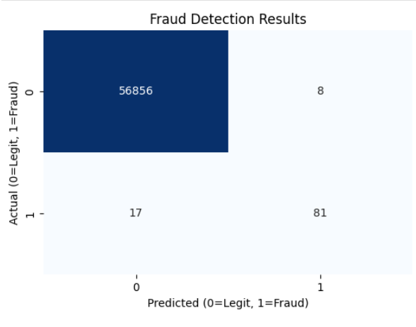

# 💳 Credit Card Fraud Detection System

## 📌 Project Overview
This project implements a Machine Learning model designed to detect fraudulent credit card transactions. The challenge with fraud detection is the **severe class imbalance**—fraud cases are extremely rare (only 0.17% of the data) compared to legitimate transactions.

I solved this by using **SMOTE (Synthetic Minority Over-sampling Technique)** to balance the dataset and trained a **Random Forest Classifier** to identify patterns in the data.

## 📊 Key Results
The model was tested on an unseen test set (20% of the original data).
- **Accuracy:** ~99.9%
- **Fraud Recall (Sensitivity):** ~83% (Successfully caught 81 out of 98 fraud cases)
- **Precision:** ~91% (Only 8 false alarms out of 56,000+ normal transactions)

### Confusion Matrix


## 🛠️ Technologies Used
- **Python 3.13**
- **Scikit-Learn** (Random Forest, Evaluation Metrics)
- **Imbalanced-Learn** (SMOTE for data balancing)
- **Pandas & NumPy** (Data Manipulation)
- **Matplotlib & Seaborn** (Data Visualization)

## 🚀 How It Works
1.  **Data Preprocessing:**
    - Scaled the `Amount` and `Time` columns using `StandardScaler` to normalize the data.
    - Split the data into Training (80%) and Testing (20%) sets.
2.  **Handling Imbalance:**
    - Applied **SMOTE** to the training data *only*. This generated synthetic fraud examples to make the split 50/50 for training, allowing the model to learn fraud features effectively.
3.  **Model Training:**
    - Trained a `RandomForestClassifier` with 100 decision trees.
4.  **Evaluation:**
    - Evaluated the model on the *original, imbalanced* test set to simulate real-world performance.

## 💻 How to Run This Project
1.  **Clone the repository:**
    ```bash
    git clone [https://github.com/your-username/Credit-Card-Fraud-Detection.git](https://github.com/your-username/Credit-Card-Fraud-Detection.git)
    ```
2.  **Install the required libraries:**
    ```bash
    pip install pandas numpy scikit-learn imbalanced-learn seaborn matplotlib
    ```
3.  **Run the Jupyter Notebook:**
    ```bash
    jupyter lab
    ```
4.  Open `Fraud_Detection_Model.ipynb` and run all cells.

## 🔮 Future Improvements
- **Deep Learning:** Experiment with Neural Networks (ANN/CNN) to see if recall can be improved beyond 85%.
- **Hyperparameter Tuning:** Use GridSearch to optimize the Random Forest settings.
- **API Deployment:** Build a Flask/FastAPI endpoint to serve the model for real-time predictions.
